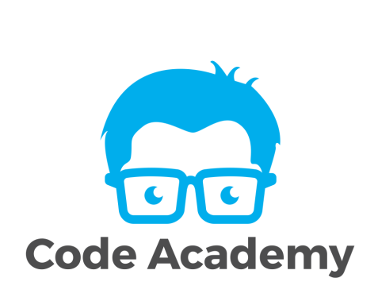

  

# Code Academy 2 lygio Java programavimo kalbos kursai
Mokomoji medžiaga skirta [Code Academy](https://www.codeacademy.lt/) programavimo kursams. 

### Paskaitų temos:
- [Įvadas](/introduction)
- [Java programavimo pagrindai](/java-basics)
- [Versijų valdymas įrankiu Git](/vsc-basics-with-git)
- [Sąsajos ir paveldėjimas](/inheritance)
- [Išimtys](/exceptions)
- [Darbas su failais](/files)
- [Generics](/generics)
- [Projektai](/projects)
- [Comparator](/comparator)
- [Priėjimo modifikatoriai](/access-modifiers)
- [Kolekcijų karkasas](/collections-framework)
- [*Lambda* išraiškos ir srautai](/streams-and-lambdas)
- [Maven](/maven)
- [Programinės įrangos testavimas](/unit-testing)
- [Serializacija ir JSON](/serialization-json)
- [Kartojimo užduotys](/more-exercises)
- [Java Date Time API](/java-date-time-api)
