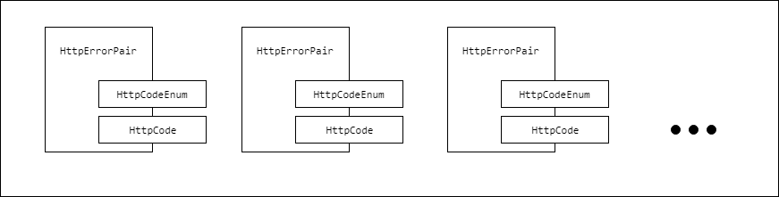

## Užduotys: *Comparator*

## Nr. 1

### Užduotis

Sukurti klasę `JavaStudentGroup`, kuri turi sąrašą studentų. Klasė `Student` turi vardą, pavardę ir studento numerį. 
Suskurti klasės su sąrašu objektą ir į jį įdėti 21 studentą. Studentus išrūšiuoti pagal vardą, pagal pavardę ir pagal studento nr. Studentus suskirstyti į 4 grupes. Kodas turi būti parašytas taip, kad lengvai galėtumėte suskirstyti studentus į kitokį skaičių grupių.

## Nr. 2

### Užduotis

Sukurti klasę X, kuri turi sąrašą skaičių. Sukurti klasę Y, kuri saugo prieš tai sukurtos klasės objektų sąrašą. 
Surūšiuoti skaičius sąraše. Surūšiuoti Y elementus saugantį sąrašą pagal tai, kokia yra jo sąraše esančių skaičių suma. Programa turi mokėti rūšiuoti tiek didėjimo, tiek ir mažėjimo tvarka.

## Nr. 3

### Užduotis



1. Sukurkite enum'ą `HttpCodeEnum` su reikšmėmis `CODE_404`, `CODE_401`, `CODE_500` ir pan.
2. Sukurkite enum'ą `ErrorLevels` su reikšmėmis `HIGH`, `LOW`, `MEDIUM` ir pan. Kiekviena enum'o reikšmė turi turėti kažkokį skaičių, pvz `HIGH` yra `2`, `LOW` yra `0`.
3. Sukurkite klasę `HttpCode`, kuri turi klasės atributą `ErrorLevels` tipo.
4. Sukurkite keletą `HttpCode` klasę paveldinčių klasių, tokių kaip `NotFoundHttpCode`, `BadRequestHttpCode`, `InternalServerErrorHttpCode` ir pan.
5. Sukurkite klasę `HttpErrorPair`, kuri turi *generics* tipo du klasės kintamuosius (*key* ir *value*). Pirmasis gali būti bet kokio tipo, antrasis turi galėti būti tik `HttpCode` tipo arbą šios klasės vaikinių klasių tipo.
6. Sukurkite tuščią sąrašą ir į jį įdėkite keletą `HttpErrorPair` objektų. 
    ```java
    pairList.add(new HttpErrorPair(HttpCodeEnum.CODE_500, new InternalServerErrorHttpCode(ErrorLevels.HIGH)));
    pairList.add(new HttpErrorPair(HttpCodeEnum.CODE_401, new BadRequestHttpCode(ErrorLevels.MEDIUM)));
    pairList.add(new HttpErrorPair(HttpCodeEnum.CODE_404, new NotFoundHttpCode(ErrorLevels.LOW)));
    pairList.add(new HttpErrorPair(HttpCodeEnum.CODE_403, new ForbiddenHttpCode(ErrorLevels.MEDIUM)));
    ```
7. Atspausdinkite sąrašą, surūšiuokite pagal `ErrorLevels` enum'o reikšmes ir atspausdinkite surūšiuotą sąrašą. Gausite panašiai tokį rezultatą:
    ```
    [HttpErrorPair{key=CODE_500, code=HttpCode{level=HIGH}}, HttpErrorPair{key=CODE_401, code=HttpCode{level=MEDIUM}}, HttpErrorPair{key=CODE_404, code=HttpCode{level=LOW}}, HttpErrorPair{key=CODE_403, code=HttpCode{level=MEDIUM}}]
    [HttpErrorPair{key=CODE_404, code=HttpCode{level=LOW}}, HttpErrorPair{key=CODE_401, code=HttpCode{level=MEDIUM}}, HttpErrorPair{key=CODE_403, code=HttpCode{level=MEDIUM}}, HttpErrorPair{key=CODE_500, code=HttpCode{level=HIGH}}]
    ```

8. Nepamirškite metodo `toString` teisingai panaudoti `Comparable`. 