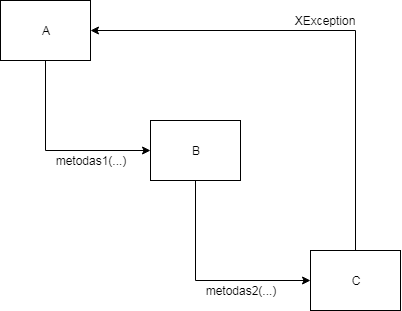

## Užduotys: *Exceptions*

## Nr. 1

### Užduotis

Klasėje `A` yra kviečiamas klasės `B` metodas. Klasėje `B` yra kviečiamas klasės `C` metodas. Klasės `C` metodas iššaukia klaidą. Šią klaidą reikia apdoroti klasėje `A`.

## Nr. 2

### Užduotis

1. Sukurkite klasę `Input`. Klasė turi metodą, kurį iškvietus programa vartotojo paprašo įvesti sveikąjį skaičių ir metodas įvestą skaičių grąžina.
2. Kitoje klasėje metode `main` iškvieskite klasės `Input` metodą.
3. Įvestą skaičių atspausdinkite.
4. Paleiskite programą ir įveskite skaičių su slankuoju kableliu. gausite klaidą.
5. Apsaugokite programą nuo 'nulūžimo' - įvedus ne sveikąjį skaičių programa turi pranešti, kad įvesti netinkami duomenys ir prašys įvesti skaičių dar kartą. Programa prašys įvesti skaičių tol kol jį vartotojas įves teisingai.
