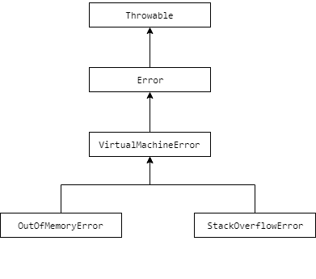
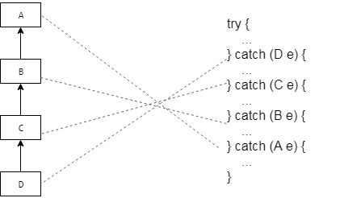

# Išimtys *(exceptions)*

### Teorija



Klaidų klasės `OutOfMemoryError` ir `StackOverflowError` yra `VirtualMachineError` vaikai.

Pavyzdys:
```java
import java.util.ArrayList;
import java.util.List;

public class Main {

    public static void main(String[] args) {

        try {
            notSafeMethod();
        } catch (OutOfMemoryError e) {
            System.out.println("Out of memory");
        } catch (VirtualMachineError error) {
            System.out.println("VM error");
        }

    }

    public static void notSafeMethod() {
        // kodas, kuris iššauks OutOfMemoryError:
        List<String> list = new ArrayList<>();
        while (true) {
            list.add(new String("Hello!"));
        }
        // kodas, kuris iššauks StackOverflowError:
        //notSafeMethod();
    }

}
```
Ši kodo dalis
```java
try {
    notSafeMethod();
} catch (OutOfMemoryError e) {
    System.out.println("Out of memory");
} catch (VirtualMachineError error) {
    System.out.println("VM error");
}
```
reiškia, kad programa kvies galimai nesaugų metodą `notSafeMethod` ir įvykus klaidai `OutOfMemoryError` atspausdins `Out of memory`. Jei įvyks `VirtualMachineError` arba jos vaikinės klasės tipo klaida, pavyzdžiui `StackOverflowError`, tada atspausdins `VM error`. Blokuose `catch` klaidų ir išimčių klasės turi būti išvardijamos iš eilės - pradedant nuo vaikinių klasių viršuje ir baigiant tėvine klase apačioje.

Aukščiau aprašytas `notSafeMethod` metodas iššauks `OutOfMemoryError` klaidą. Metode `main` šio tipo klaidos tikimasi `catch (OutOfMemoryError e)`, todėl bus atspausdinta `Out of memory`. 

Galime galime sumažinti Java programa išskiriamą atmintį naudjant parametrą `-Xmx2M`. Užrašas `2M` reiškia, kad programa turės 2 MB atminties.

Jei metodą `notSafeMethod` pakeisime į tokį:
```java
public static void notSafeMethod() {
    // kodas, kuris iššauks OutOfMemoryError:
    //List<String> list = new ArrayList<>();
    //while (true) {
    //    list.add(new String("Hello!"));
    //}
    // kodas, kuris iššauks StackOverflowError:
    notSafeMethod();
}
```
metodas rekursiškai begalę kartų kreipsis pats į save ir tai iššauks `StackOverflowError` klaidą. Įvykus klaidai `main` metode programa iš eilės patikrins, ar tai ne `OutOfMemoryError` tipo klaida, bet `StackOverflowError` neturi jokio ryšio su `OutOfMemoryError`. Toliau programa eina į kitą `catch` bloką ir tikrina, ar tai ne `VirtualMachineError` tipo klaida. Kaip jau žinome `StackOverflowError extends VirtualMachineError` todėl šis `catch` blokas aproros klaidą ir atspausdins pranešimą `VM error`.

Jei `try-catch` bloką papildysime taip:
```java
try {
    notSafeMethod();
} catch (OutOfMemoryError e) {
    System.out.println("Out of memory");
} catch (StackOverflowError e) {
    System.out.println("Stack overflow");
} catch (VirtualMachineError error) {
    System.out.println("VM error");
}
```
tada programa atspausdins `Stack overflow`, kai įvyks `StackOverflowError` klaida.

Jei `try-catch` bloką supaprastinsime pašalindami dalį `catch` blokų:
```java
try {
    notSafeMethod();
} catch (VirtualMachineError error) {
    System.out.println("VM error");
}
```
Tada įvykus `OutOfMemoryError` arba `StackOverflowError` arba kitai `VirtualMachineError` tipo klaidai, programa spausdins `VM error`.



### Užduotys
- [Užduotys](exercises/readme.md)

### Naudingos nuorodos

- [`Java išimčių klasių hierarchija`](https://airbrake.io/blog/java-exception-handling/the-java-exception-class-hierarchy)


