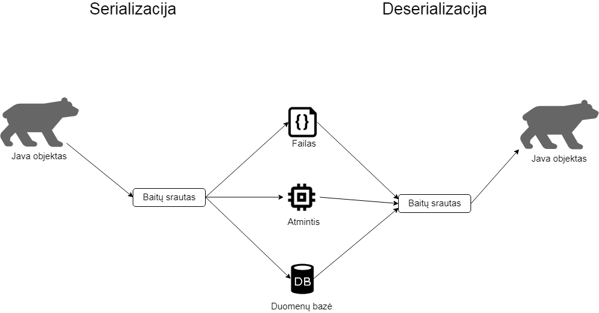

# Serializacija ir JSON

## Turinys
- [Serializacija ir deserializacija](#Serializacija-ir-deserializacija)
- [JSON](#JSON)
    - [Java objekto serializavimas į JSON](#Java-objekto-serializavimas-į-JSON)
    - [JSON deserializavimas į Java objektą](#JSON-deserializavimas-į-Java-objektą)
    - [Java objekto konvertavimas į JSON eilutę ir atvirščiai](#Java-objekto-konvertavimas-į-JSON-eilutę-ir-atvirščiai)
    - [Sąrašo konvertavimas į JSON ir atvirščiai](#Sąrašo-konvertavimas-į-JSON-ir-atvirščiai)
    - [JSON konvertavimas į Java MAP](#JSON-konvertavimas-į-Java-MAP)
    - [JSON konvertavimas į Java objektą su nežinomais laukais](#JSON-konvertavimas-į-Java-objektą-su-nežinomais-laukais)
    - [Individualizuotas serializatorius](#Individualizuotas-serializatorius)
    - [Individualizuotas deserializatorius](#Individualizuotas-deserializatorius)
    - [JsonProperty anotacijos naudojimas](#JsonProperty-anotacijos-naudojimas)
    - [JSON alternatyvos](#JSON-alternatyvos)
- [Tolesniam skaitymui](#Tolesniam-skaitymui)
- [Užduotys](#Užduotys)


## Serializacija ir deserializacija




Klasės gali būti serializuojamos ir deserializuojamos. Gali būti serializuojamos vienoje sistemoje, o deserializuojamos kitoje.
Klasės, kurias norime serializuoti, turi įgyvendinti `Serializable` interfeisą. 

Java klasė `ObjectOutputStream` gali primityviuosius tipus ir objektus gali paversti į baitų srautą, o baitų srautą skaito ir gali pavesti į Objektus ir primityviuosius klasė `ObjectInputStream`.

Svarbiausias `ObjectOutputStream` metodas yra:
```java
public final void writeObject(Object o) throws IOException;
```
kuris paima serializuojamą objektą ir paverčia jį į baitų srautą.

`ObjectInputStream` atveju metodas, kuris skaito baitų srautą ir paverčia jį atgal į Java objektą yra:
```java
public final Object readObject() throws IOException, ClassNotFoundException;
```

Pavyzdys. Turime klasę `Asmuo` su keliais klasės kintamaisiais:
```java
import java.io.Serializable;

public class Asmuo implements Serializable {

    private String vardas;
    private int amzius;

    // getteriai ir setteriai
}
```
Tada sukuriame `Asmuo` objektą ir jį serializuojame į failą, vėliau iš failo deserializuojame atgal į Java objektą ir atspausdiname objekto reikšmes:
```java
Asmuo asmuo = new Asmuo();
asmuo.setVardas("Jurgis");
asmuo.setAmzius(50);

FileOutputStream fileOutputStream = new FileOutputStream("asmens_failas.txt");
ObjectOutputStream objectOutputStream = new ObjectOutputStream(fileOutputStream);
objectOutputStream.writeObject(asmuo);
objectOutputStream.flush();
objectOutputStream.close();

FileInputStream fileInputStream = new FileInputStream("asmens_failas.txt");
ObjectInputStream objectInputStream = new ObjectInputStream(fileInputStream);
Asmuo asmuo2 = (Asmuo) objectInputStream.readObject();
objectInputStream.close();

System.out.println(asmuo2.getVardas());
System.out.println(asmuo2.getAmzius());
``` 
```
Jurgis
50
```

Java objektas serializuojamas į baitų srautą:
```java
objectOutputStream.writeObject(asmuo);
```

Iš baitų srauto deserializuojama į Java objektą:
```java
Asmuo asmuo2 = (Asmuo) objectInputStream.readObject();
```
Operacija *cast* šioje vieotje yra būtina.

Naudojant `transient` operatorių galime nurodyti kurios objekto dalies nenorime serializuoti. Pavyzdžiui nenorime serializuoti slaptažodžių dėl saugumo.
```java
public class Asmuo implements Serializable {

    private transient String vardas;
    private int amzius;

    // getteriai ir setteriai
}
```
Tada pagal anstesnį serializavimo, deserialiazavimo ir objekto reikšmių atspausdinimo pavyzdį gautume rezultatą:
```
null
50
```
Jei klasė įgyvendina `Serializable` interfeisą, tai visų tos klasės vaikų (paveldinčių klasių) objektai taip pat galės būti serializuojami. Tačiau kompozicijos atveju kiekviena klasė turi įgyvendinti `Serializable` interfeisą. Pavyzdys:
```java
public class Asmuo implements Serializable {

    transient private String vardas;
    private int amzius;
    private Adresas adresas;

    // getteriai ir setteriai
}
```
Tada klasė `Adresas` taip pat turi įgyvendinti `Serializable` interfeisą.

Serializacijoje yra naudojamas `serialVersionUID`. Pavyzdys:
```java
public class Asmuo implements Serializable {

    private static final long serialVersionUID = 1L;

    transient private String vardas;
    private int amzius;

    // getteriai ir setteriai
}
```
`serialVersionUID` yra skaičius, kuris užtikrina, kad objektas, kurį deserilizuojame, atitiks klasės sandarą, kuri buvo serializuojant objektą. `serialVersionUID` yra didelis skaičius, paskaičiuojamas pagal klasės pavadinimą, klasės atributus ir klasėje naudojamus prėjimo modifikatorius. Jei šis skiačius nėra parašytas klasėje, tada JVM tai padaro už mus. 
Jei serializuosime objektą, o vėliau pakeisime klasę, pvz. parašysime naują metodą, tada deserializuojant gausime `InvalidClassException` klaidą, nes `serialVersionUID`, kuriuos generuoja pati JVM, nesutaps. To išvengti padėtų, jei mes patys priskitume `serialVersionUID` reikšmę.

Jei bandysime serializuoti objektą, kurio klasė neįgyvendina `Serializable` interfeiso, tada gausime `NotSerializableException` klaidą.

Serializavimo/deserializamino procesą galime šiek tiek modifikuoti. Pavyzdžiui turime klasę `Adresas`:
```java
public class Adresas {
    
    private String miestas;
    private String gatve;

    // getteriai ir setteriai
}
```
ir turime klasę `Asmuo`, kurioje adresas yra pažymėtas kaip `transient`, t.y. neserializuojamas:
```java
public class Asmuo implements Serializable {

    private String vardas;
    private int amzius;
    private transient Adresas adresas;

    // getteriai ir setteriai
}
```
bet norime serializuoti adresą. Tada klasėje `Asmuo` turime sukurti `writeObject` ir `readObject` metodus:
```java
public class Asmuo implements Serializable {

    private String vardas;
    private int amzius;
    private transient Adresas adresas;

    private void writeObject(ObjectOutputStream oos) throws IOException {
        oos.defaultWriteObject();
        oos.writeObject(adresas.getMiestas());
        oos.writeObject(adresas.getGatve());
    }

    private void readObject(ObjectInputStream ois) throws ClassNotFoundException, IOException {
        ois.defaultReadObject();
        String miestas = (String) ois.readObject();
        String gatve = (String) ois.readObject();
        Adresas adresas = new Adresas();
        adresas.setMiestas(miestas);
        adresas.setGatve(gatve);
        this.setAdresas(adresas);
    }

    // getteriai ir setteriai
}
```
Tokiu atveju adresas bus serializuotas ir galėsime deserializuojant gauti miestą bei gatvę.
```java
Asmuo asmuo = new Asmuo();
asmuo.setVardas("Jurgis");
asmuo.setAmzius(50);

Adresas adresas = new Adresas();
adresas.setMiestas("Vilnius");
adresas.setGatve("Sauletekio");
asmuo.setAdresas(adresas);

FileOutputStream fileOutputStream = new FileOutputStream("asmens_failas.txt");
ObjectOutputStream objectOutputStream = new ObjectOutputStream(fileOutputStream);
objectOutputStream.writeObject(asmuo);
objectOutputStream.flush();
objectOutputStream.close();

FileInputStream fileInputStream = new FileInputStream("asmens_failas.txt");
ObjectInputStream objectInputStream = new ObjectInputStream(fileInputStream);
Asmuo asmuo2 = (Asmuo) objectInputStream.readObject();
objectInputStream.close();

System.out.println(asmuo2.getVardas());
System.out.println(asmuo2.getAmzius());
System.out.println(asmuo2.getAdresas().getMiestas());
System.out.println(asmuo2.getAdresas().getGatve());
```
Rezultatas:
```
Jurgis
50
Vilnius
Sauletekio
```

## JSON

Naudosime Jackson:

```xml
<dependency>
    <groupId>com.fasterxml.jackson.core</groupId>
    <artifactId>jackson-databind</artifactId>
    <version>2.9.4</version>
</dependency>
```

### Java objekto serializavimas į JSON

Java objektą serializuosime į JSON failą.

Turime enum `Salis`:
```java
public enum Salis {
    LIETUVA,
    LATVIJA,
    ESTIJA
}
```

Turime klasę `Adresas`:
```java
public class Adresas {

    private Salis salis;
    private String miestas;
    private String gatve;
    private String namoNr;

    public Adresas() {
        // default konstruktorius bus reikalingas norint is JSON pagaminti Java objektą
    }

    public Adresas(Salis salis, String miestas, String gatve, String namoNr) {
        this.salis = salis;
        this.miestas = miestas;
        this.gatve = gatve;
        this.namoNr = namoNr;
    }

    // getteriai ir setteriai
}
```

Atskiroje kalsėje `main` metode sukuriame adreso objektą:
```java
Adresas adresas = new Adresas(Salis.LIETUVA, "Vilnius", "Sauletekio", "15");
```

Taip pat sukuriame Jackson Object mapper'į:
```java
ObjectMapper mapper = new ObjectMapper();
```

Norėdami serializuoti adreso objektą į `json` failą sukuriame failo objektą ir jį kartu su adreso objektu paduodame Object mapper'io metodui `writeValue(...)`:
```java
File file = new File("target/adresas.json");
mapper.writeValue(file, adresas);
```
Tada kataloge `target` bus sukurtas `adresas.json` failas:
```json
{
  "salis": "LIETUVA",
  "miestas": "Vilnius",
  "gatve": "Sauletekio",
  "namoNr": "15"
}
```

### JSON deserializavimas į Java objektą

JSON failą deserializuosime į Java objektą.

Turime failą, kuriame yra JSON formatu saugomi duomenys apie adresą. Šį failą ir adreso klasę paduosime Object mapper'io metodui `readValue(...)`:
```java
ObjectMapper mapper = new ObjectMapper();

File file = new File("target/adresas.json");

Adresas adresasIsJsonFailo = mapper.readValue(file, Adresas.class);

System.out.println(adresasIsJsonFailo.getSalis());
System.out.println(adresasIsJsonFailo.getMiestas());
System.out.println(adresasIsJsonFailo.getGatve());
System.out.println(adresasIsJsonFailo.getNamoNr());
```
Rezultatas bus:
```
LIETUVA
Vilnius
Sauletekio
15
```

### Java objekto konvertavimas į JSON eilutę ir atvirščiai

Turime adreso objektą:
```java
Adresas adresas = new Adresas(Salis.LIETUVA, "Vilnius", "Sauletekio", "15");
```
Norėdami konvertuoti jį į String eilutę kviečiame Object mapper'io metodą `writeValueAsString(...)` paduodami jam adreso objektą:
```java
ObjectMapper mapper = new ObjectMapper();

String jsonInString = mapper.writeValueAsString(adresas);

System.out.println(jsonInString);
```
Rezultatas bus:
```json
{"salis":"LIETUVA","miestas":"Vilnius","gatve":"Sauletekio","namoNr":"15"}
```

Turime JSON eilutę:
```java
String jsonEilute = "{\"salis\":\"LIETUVA\",\"miestas\":\"Vilnius\",\"gatve\":\"Sauletekio\",\"namoNr\":\"15\"}";
```

Norėdami konveruoti JSON eilutę į Java objektą Objeck mapper'io metodui `readValue(...)` paduodame JSON eilutą ir objekto, į kurį konvertuosime, klasę:
```java
Adresas adresasIsJsonEilutes = mapper.readValue(jsonEilute, Adresas.class);

System.out.println(adresasIsJsonEilutes.getSalis());
System.out.println(adresasIsJsonEilutes.getMiestas());
System.out.println(adresasIsJsonEilutes.getGatve());
System.out.println(adresasIsJsonEilutes.getNamoNr());
```

Rezultatas bus:
```
LIETUVA
Vilnius
Sauletekio
15
```

### Sąrašo konvertavimas į JSON ir atvirščiai

Turime sąrašą su adresais ir norėdamį jį konvertuoti į JSON dirbame taip pat kaip ir su bet kokiu kituJava objektu:
```java
List<Adresas> adresai = new ArrayList<>();

Adresas adresas1 = new Adresas(Salis.LIETUVA, "Vilnius", "Sauletekio", "15");
Adresas adresas2 = new Adresas(Salis.LIETUVA, "Vilnius", "Antakalnio", "17");

adresai.add(adresas1);
adresai.add(adresas2);

ObjectMapper mapper = new ObjectMapper();

String jsonAdresai = mapper.writeValueAsString(adresai);
System.out.println(jsonAdresai);
```

Rezultatas bus:

```json
[
  {
    "salis": "LIETUVA",
    "miestas": "Vilnius",
    "gatve": "Sauletekio",
    "namoNr": "15"
  },
  {
    "salis": "LIETUVA",
    "miestas": "Vilnius",
    "gatve": "Antakalnio",
    "namoNr": "17"
  }
]
```

Turime JSON eilutę su sąrašu adresų. Norėdami tokią eilutę konvertuoti į Java objektų sąrašą naudojame Object mapper'io metodą `readvalue(...)` paduodant jam JSON eilutę ir `List` klasę:
```java
String jsonAdresai = "[{\"salis\":\"LIETUVA\",\"miestas\":\"Vilnius\",\"gatve\":\"Sauletekio\",\"namoNr\":\"15\"},{\"salis\":\"LIETUVA\",\"miestas\":\"Vilnius\",\"gatve\":\"Antakalnio\",\"namoNr\":\"17\"}]";

ObjectMapper mapper = new ObjectMapper();
List<Adresas> adresuSarasas = mapper.readValue(jsonAdresai, new TypeReference<List<Adresas>>(){});
```

### JSON konvertavimas į Java MAP

Turime JSON eilutę ir norime ją konvertuoti į Java Map'ą:

```java
String jsonEilute = "{\"salis\":\"LIETUVA\",\"miestas\":\"Vilnius\",\"gatve\":\"Sauletekio\",\"namoNr\":\"15\"}";

ObjectMapper mapper = new ObjectMapper();
Map<String, Object> map = mapper.readValue(jsonEilute, new TypeReference<Map<String,Object>>(){});
```

### JSON konvertavimas į Java objektą su nežinomais laukais

Sakykime JSON eilutėje yra laukas `pastoKodas` su reikšme `00000`. Tokio lauko klasėje `Adresas` nėra.
Konvertuojant tokį JSON į adreso objketą:
```java
String jsonEilute = "{\"salis\":\"LIETUVA\",\"miestas\":\"Vilnius\",\"gatve\":\"Sauletekio\",\"namoNr\":\"15\",\"pastoKodas\": \"00000\"}";

ObjectMapper mapper = new ObjectMapper();

Adresas adresas = mapper.readValue(jsonEilute, Adresas.class);
```

Gausime klaidą:
```
Exception in thread "main" com.fasterxml.jackson.databind.exc.UnrecognizedPropertyException: Unrecognized field "pastoKodas" (class lt.codeacademy.Adresas), not marked as ignorable (4 known properties: "salis", "gatve", "miestas", "namoNr"])
```

Tokiu atveju Object mapper'iui galime nurodyti ignoruoti nežinomus laukus nustatant konfigūracijos parametrą `FAIL_ON_UNKNOWN_PROPERTIES` į `false`:
```java
String jsonEilute = "{\"salis\":\"LIETUVA\",\"miestas\":\"Vilnius\",\"gatve\":\"Sauletekio\",\"namoNr\":\"15\",\"pastoKodas\": \"00000\"}";

ObjectMapper mapper = new ObjectMapper();
mapper.configure(DeserializationFeature.FAIL_ON_UNKNOWN_PROPERTIES, false);

Adresas adresas = mapper.readValue(jsonEilute, Adresas.class);
```

### Individualizuotas serializatorius

Galime sukurti savo individualizuotą serializatorių (*custom serializer*).

Sakykime norime, kad raktai JSONé būtų angliski.
Turime sukurti klasę `AdresoSerializeris` , kuri paveldi Jackson klasę `StdSerializer`. Sukurtoje klasėje sukuriame du konstruktorius - vienas be parametrų, kitas `Class` tipo parametru. kadangi klasėje `StdSerializer` yra anstraktus metodas `serialize(...)` todėl turime jį įgyvendinti paveldinčioje klasėje `AdresoSerializeris`.

```java
public class AdresoSerializeris extends StdSerializer<Adresas> {

    public AdresoSerializeris() {
        this(null);
    }

    public AdresoSerializeris(Class<Adresas> t) {
        super(t);
    }

    @Override
    public void serialize(Adresas adresas, JsonGenerator jsonGenerator, SerializerProvider serializerProvider) throws IOException {
        jsonGenerator.writeStartObject();
        jsonGenerator.writeStringField("country", String.valueOf(adresas.getSalis()));
        jsonGenerator.writeStringField("city", adresas.getMiestas());
        jsonGenerator.writeStringField("street", adresas.getGatve());
        jsonGenerator.writeStringField("flatNo", adresas.getNamoNr());
        jsonGenerator.writeEndObject();
    }
}
```

Tada tokio serializatoriaus panadojimas:

```java
ObjectMapper mapper = new ObjectMapper();
SimpleModule module = new SimpleModule("AdresoSerializeris");
module.addSerializer(Adresas.class, new AdresoSerializeris());
mapper.registerModule(module);

Adresas adresas = new Adresas(Salis.LIETUVA, "Vilnius", "Sauletekio", "15");
String adresasJson = mapper.writeValueAsString(adresas);

System.out.println(adresasJson);
```

Rezultatas:

```json
{
  "country": "LIETUVA",
  "city": "Vilnius",
  "street": "Sauletekio",
  "flatNo": "15"
}
```

### Individualizuotas deserializatorius

Viską darome panašiaip kaip serializatoriuje, tik kuriant deserializatrių klasė turi paveldėti `StdDeserializer` ir įgyvendinti jos abstraktų metodą `deserialize(...)`.

```java
public class AdresoDeserializeris extends StdDeserializer<Adresas> {


    protected AdresoDeserializeris(Class<?> vc) {
        super(vc);
    }

    protected AdresoDeserializeris(JavaType valueType) {
        super(valueType);
    }

    protected AdresoDeserializeris(StdDeserializer<?> src) {
        super(src);
    }

    @Override
    public Adresas deserialize(JsonParser jsonParser, DeserializationContext deserializationContext) throws IOException, JsonProcessingException {
        Adresas adresas = new Adresas();

        ObjectCodec codec = jsonParser.getCodec();
        JsonNode node = codec.readTree(jsonParser);

        JsonNode salisNode = node.get("country");
        String salisString = salisNode.asText();
        Salis salis = Salis.valueOf(salisString);
        adresas.setSalis(salis);

        JsonNode miestasNode = node.get("city");
        String miestas = miestasNode.asText();
        adresas.setMiestas(miestas);

        JsonNode gatveNode = node.get("street");
        String gatve = gatveNode.asText();
        adresas.setGatve(gatve);

        JsonNode numerisNode = node.get("flatNo");
        String numeris = numerisNode.asText();
        adresas.setNamoNr(numeris);

        return adresas;
    }
}
```

Tokio deserializatoriaus panaudojimas:

```java
String adresasJson = "{\"country\":\"LIETUVA\",\"city\":\"Vilnius\",\"street\":\"Sauletekio\",\"flatNo\":\"15\"}";

ObjectMapper mapper = new ObjectMapper();
SimpleModule module = new SimpleModule("AdresoDeserializeris");
module.addDeserializer(Adresas.class, new AdresoDeserializeris(Adresas.class));
mapper.registerModule(module);

Adresas adresas = mapper.readValue(adresasJson, Adresas.class);
```

### JsonProperty anotacijos naudojimas

Norėdami pakeisti lauko, kuris bus konvertuotas į JSON nebūtinai turime rašyti savo serializatorių ir deserializatorių. Tam galime naudoti anotaciją `@JsonProperty`. Pavyzdys:

Norime, kad klasės `Adresas` laukas `namoNr` JSON'e turėtų kitą pavadinimą - `gyvenamosiosVietosNumeris`.

```java
public class Adresas {

    private Salis salis;
    private String miestas;
    private String gatve;

    @JsonProperty("gyvenamosiosVietosNumeris")
    private String namoNr;

    // konstruktoriai, getteriai ir setteriai
}
```

```java
Adresas adresas = new Adresas(Salis.LIETUVA, "Vilnius", "Sauletekio", "15");
String adresasJson = mapper.writeValueAsString(adresas);

System.out.println(adresasJson);
```

Rezultatas:

```json
{
  "salis": "LIETUVA",
  "miestas": "Vilnius",
  "gatve": "Sauletekio",
  "gyvenamosiosVietosNumeris": "15"
}
```

### JSON alternatyvos

Trumas JSON struktūros palyginimas su alternatyvomis.

```json
{
    "salis": {
        "pavadinimas": "Lietuva",
        "kodas": "LT"
    },
    "miestas": "Vilnius",
    "gatve": "Sauletekio",
    "namoNr": "15"
}
```

#### XML

```xml
<adresas>
    <salis>
        <pavadinimas>Lietuva</pavadinimas>
        <kodas>LT</kodas>
    </salis>
    <miestas>Vilnius</miestas>
    <gatve>Sauletekio</gatve>
    <namoNr>15</namoNr>
</adresas>
```

#### YAML

```yml
adresas:
    salis:
        pavadinimas: Lietuva
        kodas: LT
    miestas: Vilnius
    gatve: Sauletekio
    namoNr: 15
```


## Tolesniam skaitymui
- Serializacija: https://dzone.com/articles/serialization-amp-de-serialization-in-java
- Joshua Bloch: *Effective Java* (85-90 skyriai)
- Jackson anotacijos: https://www.baeldung.com/jackson-annotations
- Jackson: https://www.baeldung.com/jackson

## Užduotys
- [Užduotys](exercises/readme.md)